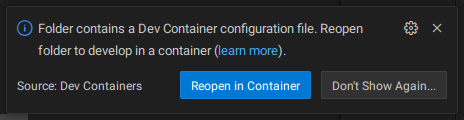
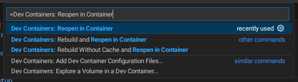
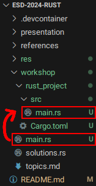
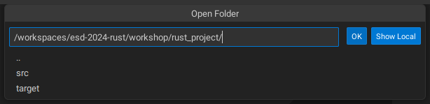

# Introduction into Rust Workshop

## Workshop Topics

## Setup

- Clone the repository
- Open the repository folder in VS Code
- A notification will pop up to reopen the folder in a Dev Container. Click on "Reopen in Container"
    
  - If you did not get a notifcation or you missed it, Press CTRL+SHIFT+P (or click "View" -> "Open Command Palette") and seach for "Dev Containers: Reopen in Container"
  

## Getting started with the Exercises

- Open a new Terminal in VS Code and navigate to the workshop folder with "cd workshop/"

- Creating a Rust Project / Basic Commands

  - Run "cargo new {project_name}" (You can choose a name for the project)

  - Navigate to your new project and run "cargo build" to compile the project

  - Run "cargo run" to run the binary

    

- Move the provided "main.rs" file containing the exercises at "workshop/main.rs" into your newly created rust project src folder to "{project_name}/src/main.rs", overriding the "main.rs" that was generated by creating the project.
  

  

- For the exercises we will use the rust-analyzer VS Code extension for code completion and other features, this should be installed already

  - rust-analyzer needs VS Code to be opened directly in the Rust project folder to work, to do this while staying inside the Dev Container, in VS Code, click on "File" -> "Open Folder" and use the dialog to open the Rust project folder you created.
    
    Do NOT click on "Show Local", as this will open the Folder without the Dev Container.
    
    

- Open the main.rs in the rust project and start working on the exercises in the file underneath the main function.

## Rust Documentation

The Rustbook: https://doc.rust-lang.org/book/
Rust by Example: https://doc.rust-lang.org/rust-by-example/

# ESD template

Please make sure all artifacts are in this GitHub repository.  
That includes:

- Code
- Workshop materials
- Presentation (if applicable)
- References.
- Docker (compose) file (if applicable)
